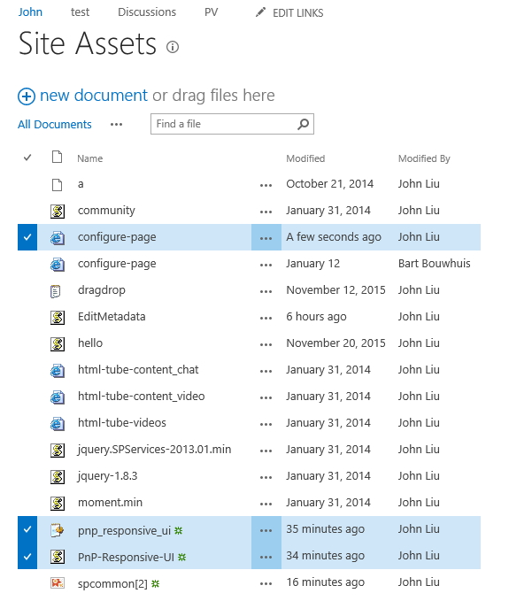
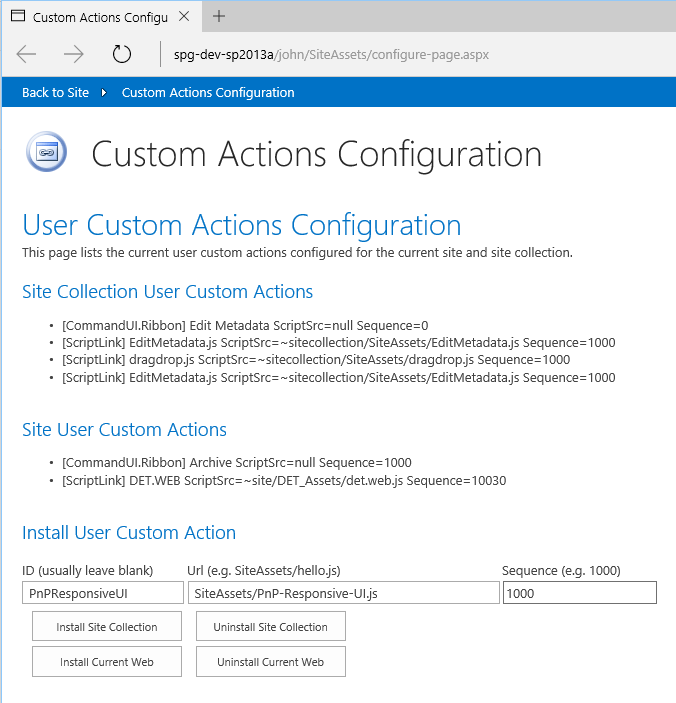
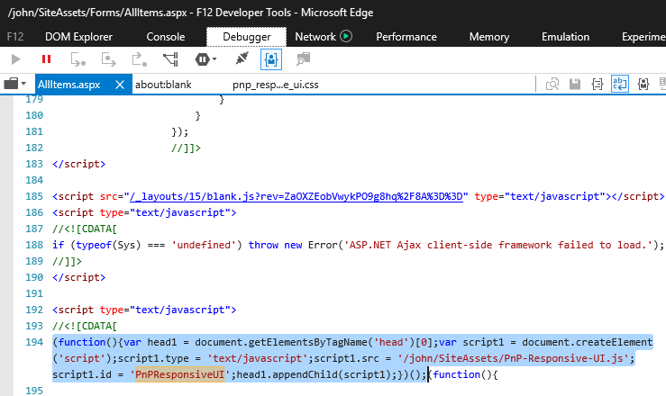
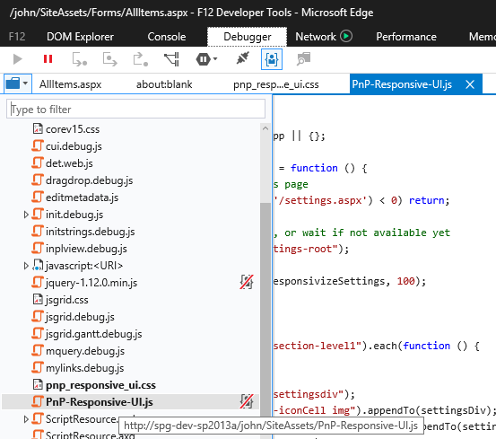
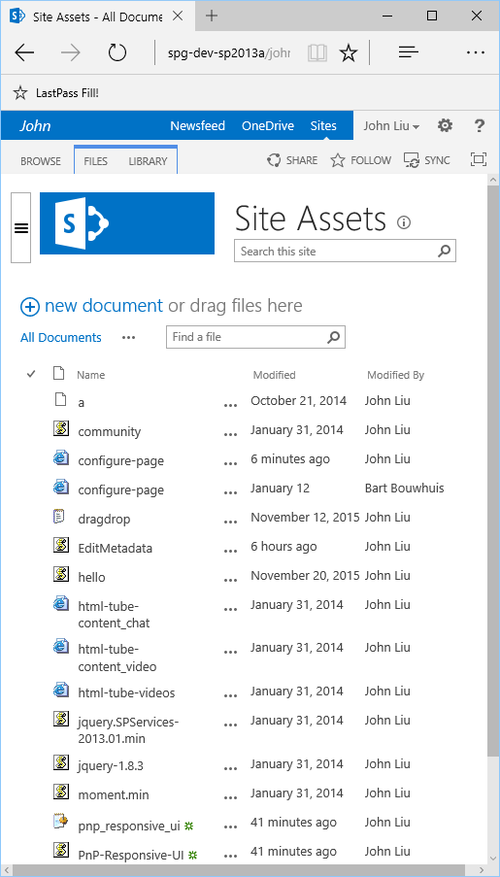
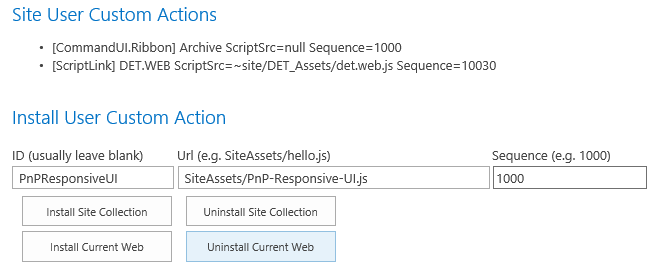
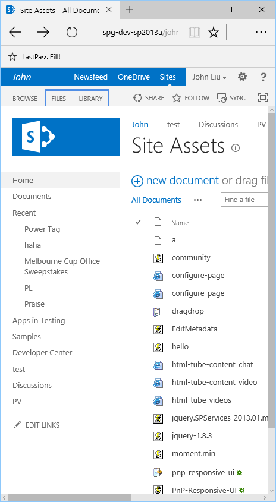

[User Custom Actions Config Page - Responsive SP2013/2016](http://johnliu.net/blog/2016/3/u1o3sximl08l60c3k0xzz4ep2fof2n) 

Refer to blog post regarding UCACP - 2016-03-10 update which enables installation of 
[PnP SharePoint 2013/2016 Responsive UI](https://github.com/OfficeDev/PnP-Tools/tree/master/Solutions/SharePoint.UI.Responsive)

# Install

3 Files!

Use **PnPResponsiveUI** as ID

# Results

Injected Script Block

Injected Script (which finds and inserts the CSS too)

Responsive UI Screenshots

# Uninstall

