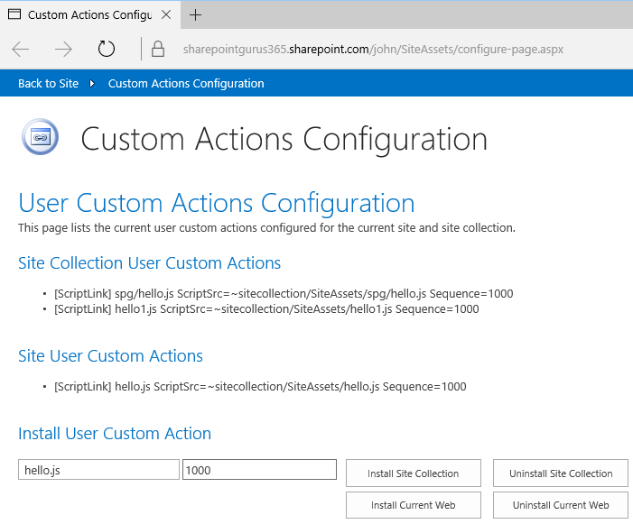
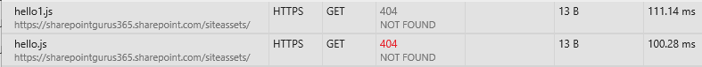

# User Custom Actions Config Page

The following is what I consider to be the easiest way to add script to your SharePoint and SharePoint Online

"Inject JavaScript to any Site or Site Collection via a User Custom Action's ScriptLink property."

# 2016-03-10 Update

* Add Script ID - this enables [PnP SharePoint 2013/2016 Responsive UI](https://github.com/OfficeDev/PnP-Tools/tree/master/Solutions/SharePoint.UI.Responsive) to be installed by [copying 3 files](http://johnliu.net/blog/2016/3/u1o3sximl08l60c3k0xzz4ep2fof2n)!
* Dropped /SiteAssets/ in path, this means you can add deep nested paths into other libraries, or even subsites.  ~sitecollection/ + url  (before was ~sitecollection/SiteAssets/ + url

# Why use User Custom Actions?

This is a great technique because it lets you:

* Add JavaScript anywhere - scoped to Site Collection or Site.
* Add CSS via JavaScript
* You can add more than 1 CSS file
* Order them the way you want via Sequence
* You can combine this to load your initial JavaScript file which can be a RequireJS setup and then hand off the controls to RequireJS config
* Does not modify MasterPage
* Works in SharePoint 2010, 2013, 2016 and SharePoint Online
* Only need Site Collection permissions to set up - you don't need to have a Farm Solution or Add-In Model.  The permission is only required to set up the ScriptLink.
* The object model provides a way for an administrator to check all the User Custom Actions attached to any site/site collection, so there's a level of oversight available if you want to check if your customizations are ready for migration.

There are various ways to attach a script via User Custom Actions.
* Remote Provisioning (Pattern and Practice) uses it via C# CSOM
* PowerShell remote provisioning
* Farm Solution can invoke the API
* Sandbox Solution can invoke the Client Side Object Model API (*with permission)
* Add-In can invoke the CSOM API as well (with Site Collection - Full Control permission)

The unfortunate part is, there's no UI for a power user to add or view ScriptLinks directly.  You need to spin up SharePoint Manager or read/update it via PowerShell.

# So what do you have here?

I build a simple config page in JavaScript. 
Then I did a load of work to make sure everything runs from One Page.

I also brand it to look a bit like SharePoint.  Just a bit.

# Install

* Drop [configure-page.aspx](dist/configure-page.aspx) into a SiteAssets or SitePages library.
* The JavaScript on the page detects and loads some dependencies (jQuery, SP.js etc). 
* Provided you have site collection permissions, it'll list all existing User Custom Actions
* You can specify a filename (including any subfolders like spg/hello.js) and give it a sequence number (default to 1000).  Then you can install a Custom Action to Site Collection or Current Web.  All via the magic of JavaScript.

# Specifying different sequence numbers.

hello.js is sequence 1000.  hello1.js is sequence 999.

# Related Links

* [SP2013/2016 Responsive-UI and UserCustomActionsConfigPage](http://johnliu.net/blog/2016/3/u1o3sximl08l60c3k0xzz4ep2fof2n)
* [SharePoint 2013/2016 Responsive UI](https://github.com/OfficeDev/PnP-Tools/tree/master/Solutions/SharePoint.UI.Responsive)
* http://johnliu.net/blog/2015/12/the-safest-future-proof-way-to-brand-your-sharepoint-and-sharepoint-online
* https://github.com/OfficeDev/PnP/tree/master/Solutions/Core.CDNManager
* https://github.com/OfficeDev/PnP/tree/master/Samples/Core.ManageUserCustomAction

